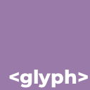

<h3 align="center">
  <br/>
  
  Glyph Language Support for <a href="https://code.visualstudio.com">VS Code</a>
  
</h3>

<p align="center">
  <b>Modern HTML-first language with components, scoped styles, and a clean build pipeline.</b>
</p>

<p align="center">
  <a href="https://github.com/knotorganization"></a>
  
  
</p>

---

## ✨ What is Glyph?

**Glyph** is a modern, HTML-first language designed for building clean UI files with:

- ✅ Components
- 🎨 Scoped styles
- 🧩 Slots
- ⚡ Simple compilation to HTML
- 🧠 Minimal syntax, no framework lock-in

This extension provides **language support and a build command** for `.glyph` files inside VS Code.

---

## 📦 Features

- 📝 Syntax highlighting for `.glyph`
- 🧠 Language configuration (comments, brackets, auto-close)
- 🔨 `Glyph: Build Project` command
- ⚡ Compiles Glyph → HTML
- 🧩 Custom components (`<Card>`, `<Button>`, etc.)
- 🎨 Scoped styles preserved in output

---

## 🚀 Installation

### Manual (Recommended for now)

1. Download the `.vsix` file
2. Open VS Code
3. Press `Ctrl + Shift + P`
4. Select **Extensions: Install from VSIX…**
5. Choose the Glyph `.vsix` file

> Marketplace release will come later when the project grows.

---

## 🧪 Usage

### Create a Glyph file

```glyph
<glyph>
  <meta title="Glyph Showcase" lang="en" />

  <style scoped>
    body {
      font-family: system-ui, sans-serif;
      background: #0d0d0d;
      color: #eaeaea;
      padding: 40px;
    }

    h1 {
      margin-bottom: 8px;
    }

    p {
      opacity: 0.85;
    }

    .row {
      display: flex;
      gap: 12px;
      margin-top: 12px;
    }

    .btn {
      padding: 10px 16px;
      border-radius: 8px;
      border: none;
      cursor: pointer;
      font-weight: 600;
    }

    .btn.primary {
      background: #4caf50;
      color: #000;
    }

    .btn.secondary {
      background: #444;
      color: #fff;
    }

    .card {
      background: #1a1a1a;
      padding: 20px;
      border-radius: 14px;
      margin-top: 20px;
      box-shadow: 0 10px 30px rgba(0,0,0,.4);
    }

    .badge {
      background: #2196f3;
      padding: 4px 10px;
      border-radius: 999px;
      font-size: 12px;
      font-weight: bold;
      display: inline-block;
      margin-bottom: 6px;
    }
  </style>

  <!-- BUTTON COMPONENT -->
  <component name="Button" props="label variant">
    <button class="btn {variant}">
      {label}
    </button>
  </component>

  <!-- CARD COMPONENT -->
  <component name="Card">
    <div class="card">
      <slot />
    </div>
  </component>

  <h1>Hello world!</h1>
  <p>Hey! I'm using Glyph.</p>

  <Card>
    <div class="badge">I'm using Glyph!</div>
    <p>This card uses:</p>
    <ul>
      <li>Scoped styles</li>
      <li>Custom components</li>
      <li>Slots</li>
      <li>Class variants</li>
    </ul>

    <div class="row">
      <Button label="Confirm" variant="primary" />
      <Button label="Cancel" variant="secondary" />
    </div>
  </Card>

</glyph>
